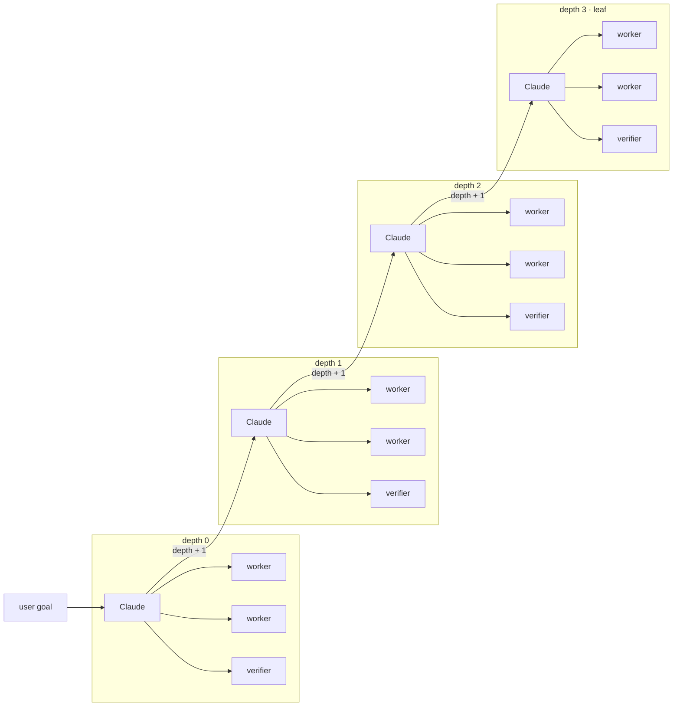

# Alpha-throttle-test

Recursive agent on Cursor Origin. Repo: `ranjan2829/Alpha-throttle-test`.

---

## Stats

Live Origin run · 23 Aug 2026 · **stopped** · target was 10 000

| tried | PRs opened | merged | errors | 429s | time |
| ---: | ---: | ---: | ---: | ---: | ---: |
| 10 000 | 10 000 | **10 000** | 472 | **0** | 68 min |

| speed | per second | per minute |
| --- | ---: | ---: |
| PRs opened | **2.35** | **141** |
| merged | **2.38** | **143** |

Latest merged PR: [#11517](https://cursor.com/codebase/allocations/Alpha-throttle-test/pull/11517)

Author: Ranjan S `<ranjan@allocations.com>`

---

## Flow

Same function, smaller slice, `depth + 1`. Stops at `maxDepth = 3`. Workers do not see siblings. Reject respawns that worker only.

```
 user goal ──► ┌ depth 0 ┐ ──► ┌ depth 1 ┐ ──► ┌ depth 2 ┐ ──► ┌ depth 3 leaf ┐
               │  Claude │     │  Claude │     │  Claude │     │  Claude      │
               │    │    │     │    │    │     │    │    │     │    │         │
               │ ┌──┼──┐ │     │ ┌──┼──┐ │     │ ┌──┼──┐ │     │ ┌──┼──┐      │
               │ w  w  V │     │ w  w  V │     │ w  w  V │     │ w  w  V      │
               │       │ │     │       │ │     │       │ │     │              │
               │      sub┼────►│      sub┼────►│      sub┼────►│   stop       │
               └─────────┘     └─────────┘     └─────────┘     └──────────────┘
```


