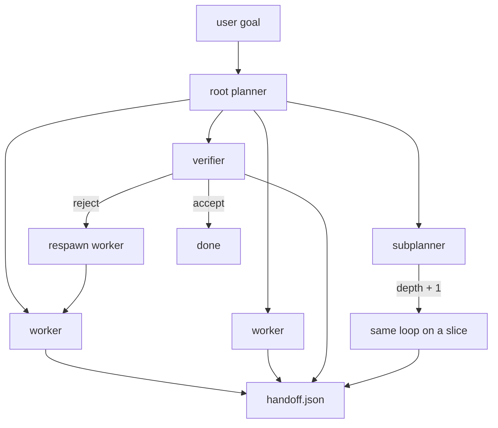
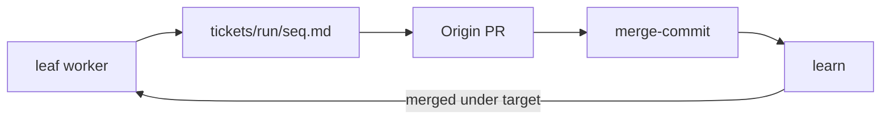

# Alpha-throttle-test

Cursor Origin recursive agent. GitHub `ranjan2829/Alpha-throttle-test`. Origin host: `ranjan-rgb/Alpha-throttle-test`.

---

## Stats

23 Aug 2026 · Origin · CI none · 429s **0**

| | attempted | opened | merged | errors | wall |
| --- | ---: | ---: | ---: | ---: | ---: |
| **Proof** | 8 | 8 | **8** | **0** | 8.1 s |
| **Clean volume** | 1 200 | 1 200 | **1 019** | **0** | 9.6 min |
| **Live** | 5 200 | | **4 920 / 100 000** | | running |

| clean volume | / min |
| --- | ---: |
| open | **124.5** |
| merge | **105.7** |

Proof [#56](https://cursor.com/codebase/allocations/Alpha-throttle-test/pull/56)–[#63](https://cursor.com/codebase/allocations/Alpha-throttle-test/pull/63) · author Ranjan S `<ranjan@allocations.com>` · merge-commit, not squash

---

## How the agent works

| node | loop? | scope | output |
| --- | --- | --- | --- |
| planner | yes | whole goal | `plan.json` |
| subplanner | yes | one slice | handoff to parent |
| worker | no | one task | `handoffs/<name>.json` |
| verifier | no | one target | accept / reject |

| bound | default |
| --- | ---: |
| maxDepth | 3 |
| maxConcurrentChildren | 3 |
| maxResawnsPerTask | 2 |
