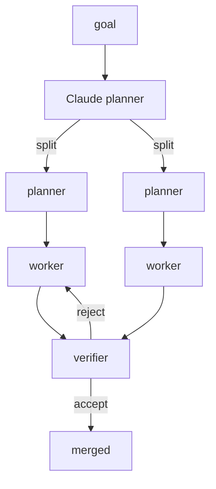
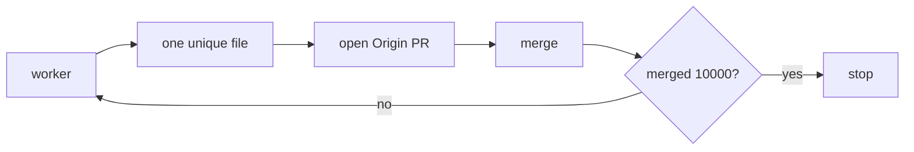

# Alpha-throttle-test

Recursive agent on Cursor Origin. Repo: `ranjan2829/Alpha-throttle-test`.

---

## Stats

Live Origin run · 23 Aug 2026 · target **10 000** merged · still going

| tried | opened | merged | errors | 429s | time | merged / min |
| ---: | ---: | ---: | ---: | ---: | ---: | ---: |
| 6 800 | 6 542 | **6 457** | 258 | **0** | 45 min | **143** |

Latest merged PR: [#6964](https://cursor.com/codebase/allocations/Alpha-throttle-test/pull/6964)

Author: Ranjan S `<ranjan@allocations.com>`

---

## How the agent works

