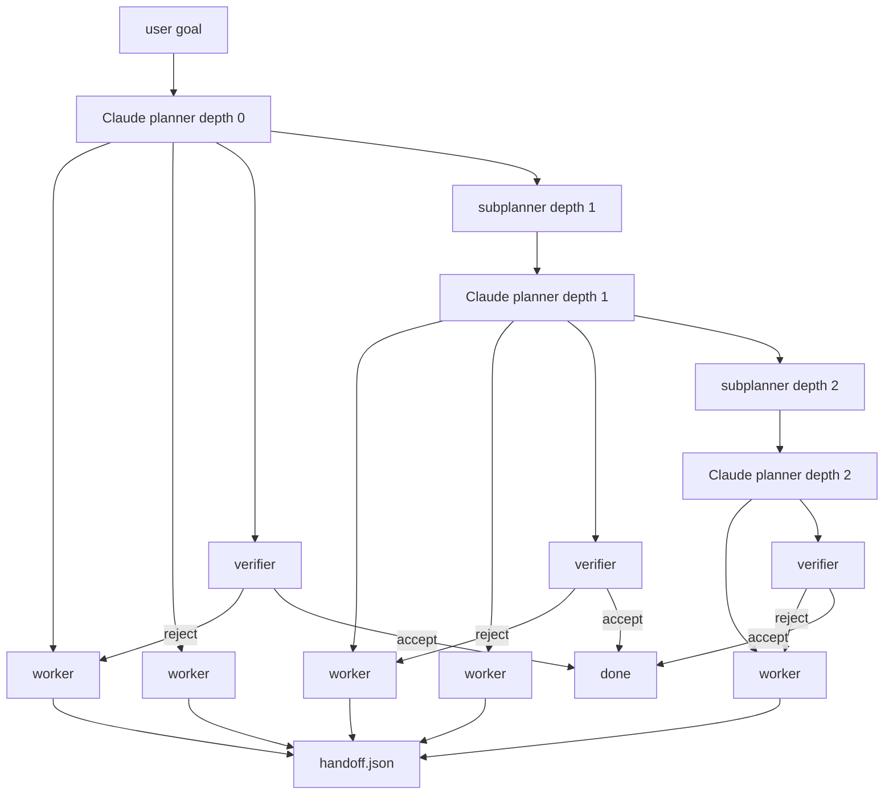

# Alpha-throttle-test

Recursive agent on Cursor Origin. Repo: `ranjan2829/Alpha-throttle-test`.

---

## Stats

Live Origin run · 23 Aug 2026 · **stopped** · target was 10 000

| tried | PRs opened | merged | errors | 429s | time |
| ---: | ---: | ---: | ---: | ---: | ---: |
| 10 000 | 10 000 | **10 000** | 472 | **0** | 68 min |

| speed | per second | per minute |
| --- | ---: | ---: |
| PRs opened | **2.35** | **141** |
| merged | **2.38** | **143** |

Latest merged PR: [#11517](https://cursor.com/codebase/allocations/Alpha-throttle-test/pull/11517)

Author: Ranjan S `<ranjan@allocations.com>`

---

## Flow

Recursive AI agent. Claude is the planner. Same function calls itself on each slice until `maxDepth`.

Hard stop: depth 3. Workers never see siblings. Leaves do one scoped task and write a handoff.
