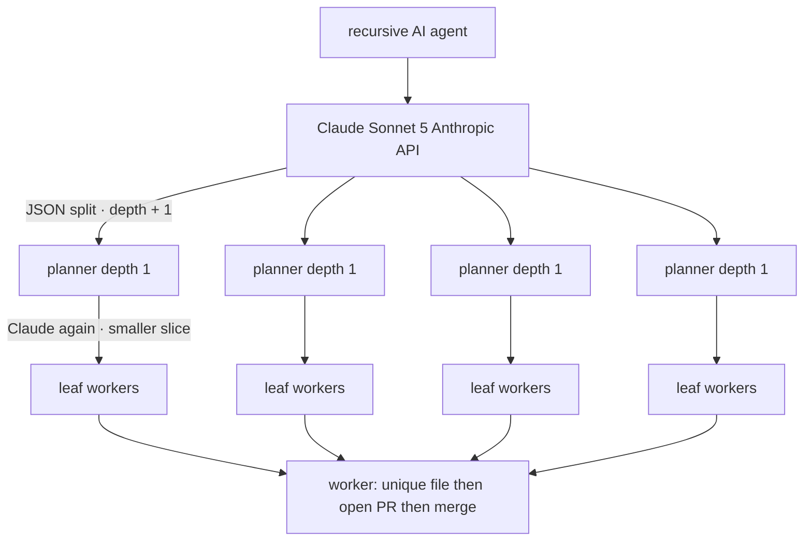

# Alpha-throttle-test

Recursive agent on Cursor Origin. Repo: `ranjan2829/Alpha-throttle-test`.

---

## Stats

Live Origin run · 23 Aug 2026 · **stopped** · target was 10 000

| tried | PRs opened | merged | errors | 429s | time |
| ---: | ---: | ---: | ---: | ---: | ---: |
| 10 000 | 10 000 | **10 000** | 472 | **0** | 68 min |

| speed | per second | per minute |
| --- | ---: | ---: |
| PRs opened | **2.35** | **141** |
| merged | **2.38** | **143** |

Latest merged PR: [#11517](https://cursor.com/codebase/allocations/Alpha-throttle-test/pull/11517)

Author: Ranjan S `<ranjan@allocations.com>`

---

## How Claude works

Claude is the planner: it splits the goal into smaller slices, and each slice can split again until maxDepth.



At `maxDepth` Claude stops. Leaves are deterministic: one file, one Origin PR, merge-commit.

---

## Self-improving dashboard

Gen 0 is a **broken** UI on purpose. The agent reads `web/src/memory.json`, applies the next highest-quality CSS repair, and remembers it so it does not redo or regress work.

```bash
npm --prefix web install
npm --prefix web run dev
# http://127.0.0.1:5173  ← broken gen 0
npx tsx src/cli.ts dashboard-improve            # one repair
npx tsx src/cli.ts dashboard-improve --generations 6
```

Planner flag (does not block the demo if no Grok key):

```bash
npx tsx src/cli.ts agent --planner grok
# needs XAI_API_KEY or GROK_API_KEY; otherwise falls back to Claude, then deterministic
```
