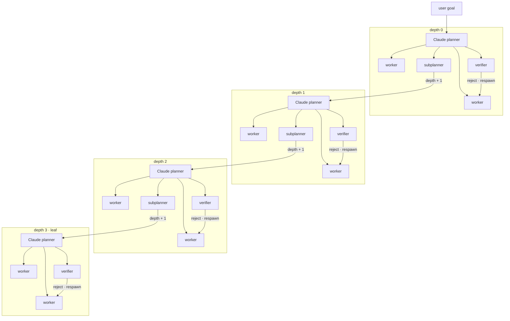

# Alpha-throttle-test

Recursive agent on Cursor Origin. Repo: `ranjan2829/Alpha-throttle-test`.

---

## Stats

Live Origin run · 23 Aug 2026 · **stopped** · target was 10 000

| tried | PRs opened | merged | errors | 429s | time |
| ---: | ---: | ---: | ---: | ---: | ---: |
| 10 000 | 10 000 | **10 000** | 472 | **0** | 68 min |

| speed | per second | per minute |
| --- | ---: | ---: |
| PRs opened | **2.35** | **141** |
| merged | **2.38** | **143** |

Latest merged PR: [#11517](https://cursor.com/codebase/allocations/Alpha-throttle-test/pull/11517)

Author: Ranjan S `<ranjan@allocations.com>`

---

## Flow

Same function, smaller slice, `depth + 1`. Stops at `maxDepth = 3`. Workers do not see siblings. Reject respawns that worker only.

```
user goal
 │
 ▼
depth 0 · Claude planner
 ├── worker
 ├── worker
 ├── verifier
 └── subplanner ──────────────┐
                              ▼
                     depth 1 · Claude planner
                      ├── worker
                      ├── worker
                      ├── verifier
                      └── subplanner ────────┐
                                             ▼
                                    depth 2 · Claude planner
                                     ├── worker
                                     ├── worker
                                     ├── verifier
                                     └── subplanner ────┐
                                                        ▼
                                               depth 3 · Claude planner
                                                ├── worker
                                                ├── worker
                                                └── verifier
                                                    (leaf · no more children)
```


