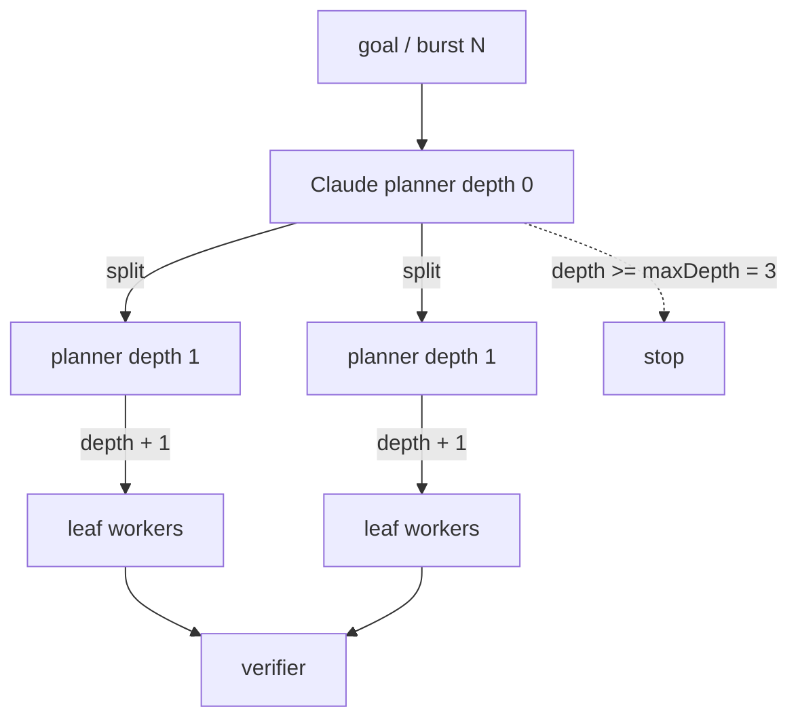
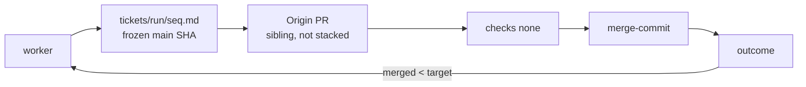
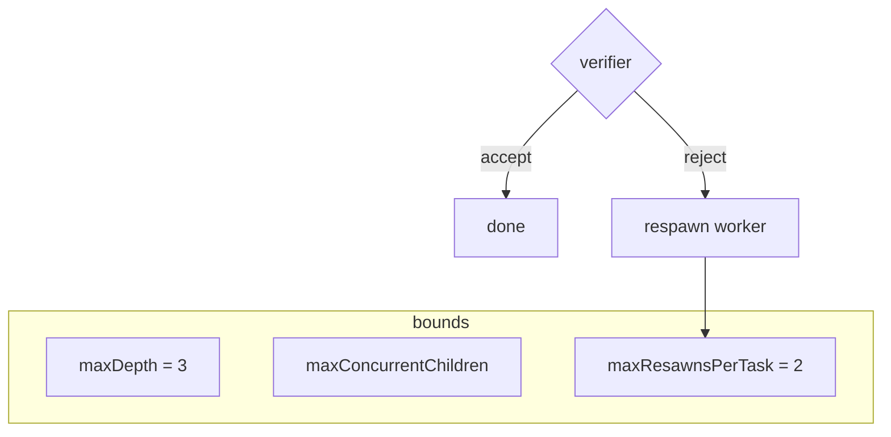

# Alpha-throttle-test

Cursor Origin recursive agent. Measured **23 Aug 2026**. Forge: [`allocations/Alpha-throttle-test`](https://cursor.com/codebase/allocations/Alpha-throttle-test). CI: none. 429s: **0**.

[`reports/live-origin.json`](reports/live-origin.json)

---

## Stats

### Proof — 8 / 8

| attempted | opened | merged | errors | 429 | wall | open | merge |
| ---: | ---: | ---: | ---: | ---: | ---: | ---: | ---: |
| 8 | 8 | **8** | 0 | 0 | 8.1 s | 1 415 ms | 3 399 ms |

PRs [#56](https://cursor.com/codebase/allocations/Alpha-throttle-test/pull/56)–[#63](https://cursor.com/codebase/allocations/Alpha-throttle-test/pull/63)

### Clean volume — 1 200 attempts

Six 200-ticket episodes. 0 errors.

| attempted | opened | merged | swept | errors | 429 | wall |
| ---: | ---: | ---: | ---: | ---: | ---: | ---: |
| 1 200 | 1 200 | **1 019** | +37 | 0 | 0 | 9.6 min |

| | / min |
| --- | ---: |
| open | **124.5** |
| merge | **105.7** |

### Live — Claude planner

| merged | target | attempted | swept | 429 | planner |
| ---: | ---: | ---: | ---: | ---: | --- |
| **4 432** | 100 000 | 4 800 | 1 002 | 0 | Claude Sonnet 5 |

First Claude cut of 400: `[100, 100, 100, 100]`

---

## How the agent works

Author: **Ranjan S `<ranjan@allocations.com>`**. Merge, not squash.
